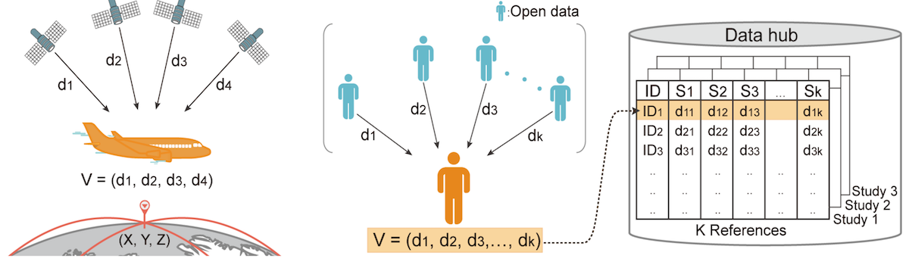

GenomicGPS `v1.0`
===================

Introduction
------------
` GenomicGPS`  is a software package for applying multilateration to genomic data. Multilateration is a technique used in the Global Positioning System (GPS). To determine the position of an aircraft, the signals from satellites are interpreted to the distances to them. Given these distances, it is possible to mathematically calculate the exact position of an aircraft. In genomic multilateration, investigators calculate genetic distances between their samples and reference samples, which are from data held in the public domain, and share this information with others. This sharing enables certain types of genomic analysis, such as identifying sample overlaps and close relatives, decomposing ancestry, and mapping of geographical origin without disclosing personal genome. Importantly, though, the shared information conceals individual genotypes, making it extremely difficult to reconstruct the personal genome. Thus, our method can be seen as a balance between open data sharing and privacy protection.



We measure the genetic distance to individuals in public data, which we call "distance vector". The software includes modules <ins>(1) to generate distance vectors given genomic data</ins> and <ins>(2) to detect overlapping samples given distance vectors</ins>.

Instructions
-------------
### Environment
Currently, `Linux` or `Mac` is required to run `GenomicGPS`.

### Downloading the package
In order to download `GenomicGPS`, you can clone this repository via the commands.

Before use 'git clone' command, please install extension of git called [Git Large File Storage (LFS)](https://github.com/git-lfs/git-lfs/wiki/Installation) for cloning the reference file (>100MB). Since it has many different ways to install LFS for various OS, please refer to [this page](https://github.com/git-lfs/git-lfs/wiki/Installation). Then, type the following to clone our repository.


```
$ git clone https://github.com/hanlab-SNU/GenomicGPS.git
$ cd GenomicGPS
```
> (If you couldn't install LSF, don't worry; you can still clone the software. However, the `Reference.tar.gz` file will not be properly cloned due to large size using `git clone` command. In that case, you can manually click and download this `Reference.tar.gz` file from our website, and put that into the cloned directory.)

### Installing required dependencies
Some software packages must be installed.

First, please make sure that [PLINK](http://zzz.bwh.harvard.edu/plink/download.shtml) is installed. The installed plink path should be added to system path. <br>
You can verify by

```
$ plink --version
```

Also, you should install [python3](https://www.python.org/downloads/) and [pip](https://pip.pypa.io/en/stable/installing/) or [anaconda](https://www.anaconda.com/distribution/#download-section) for downloading the following necessary python packages :

- numpy
- pandas
- scipy
- [datatable](https://github.com/h2oai/datatable#Installation) (It only supports MacOS, linux)

If you are using Python, you can install the required packages with:

```
$ pip install -U numpy pandas scipy datatable
```

If you are using Anaconda, you can install the required packages with:

```
$ conda install -c conda-forge numpy pandas scipy pip
$ pip install datatable
```


### Input data format
The input data has to be in [PLINK](https://www.cog-genomics.org/plink2/input)
format. <br>
Please ensure that the `.bed/.bim/.fam` filesets or `.map/.ped` filesets are all present in the same path. When you run the code, you should give the path and prefix of the data.

### Choosing the numbers of SNPs and references
To run `GenomicGPS`, we need a reference panel from public domain.
Don't worry, we've already prepared the reference dataset for you;
`Reference.tar.gz` file contains `1000Genomes Phase 3 data` (2,504 samples and 176,504 pruned SNPs with MAF>5%) formatted for our software.
The user can specify how many SNPs (`N`) and how many reference individuals (`K`) to use.
Then, our software will randomly sample `N` SNPs and `K` individuals from our prepared reference dataset
(which will add a layer of security, because SNP sets and references will be different case by case).

The rule of thumb is that we'll need `K>10` references and the SNP/reference ratio `(N/K)` needs to be `>20`. A simple choice we recommend is `K=30` and `N=1,000`.


### Distance Vector Generation (1.DV_Generator)
Our first module is for generating distance vector.
There are two usages.

#### Usage 1: Data sender
Researcher `A` wants to calculate distance vectors of his samples and send this information to Researcher `B`, so that `B` can check if there are sample overlaps.
Then, Researcher `A` runs the following:
```
$ cd 1.DV_Generator
$ chmod +x dv_gen.sh

$ ./dv_gen.sh -n N(#snps) -k K(#references) -d mydata1
```
This will generate
- `mydata1.input`: input file converted from `plink` format
- `mydata1.out`: Distance vectors
- `mydata1.ref`: Randomly sub-sampled reference data, which was used for distance vector calculation
- `mydata1.ref.p`: The MAF information of the randomly sub-sampled reference data

Then, Researcher `A` sends `mydata1.out`, `mydata1.ref`, and `mydata1.ref.p` to Researcher `B`.
Researcher `A` also lets Researcher `B` know the numbers of SNPs and references used (`K` and `N`).
> **DO NOT SEND** `mydata1.input`, because this is genotype information of the samples that we want to conceal!!


#### Usage 2: Data receiver
Researcher `B` also calculates distance vectors, but the difference is that he puts the reference information received from `A` so that the reference information can be **aligned** between the two.
```
cd 1.DV_Generator
$ chmod +x dv_gen.sh

$ ./dv_gen.sh -n N(#snps) -k K(#references) -d mydata2 -r mydata1.ref -p mydata1.ref.p
```
Given `-r` and `-p` option, our software uses the reference information from these files instead of sampling from `1000Genomes data`.
This will generate
- `mydata2.input`: input file converted from `plink` format
- `mydata2.out`: Distance vectors


### Sample Overlap Detection (2.DV_Comp_Detct)
Our second module is for detecting sample overlap given distance vectors.
Researcher `B` can now run the following:
```
$ cd 2.DV_Comp_Detct
$ chmod +x comp_det.sh
$ ./comp_det.sh -d1 mydata1.out -d2 mydata2.out -p mydata1.ref.p (+ optional : -t threshold)
```
This code compares two distance vectors to detect sample overlap. The reference allele frequency (`.ref.p`) is used to calculate &Sigma; (variance-covariance matrix). Then, the statistic and p-value will be calculated.

This will generate
- `mydata1_mydata2.outcomp_2data.stat`: Sample overlap detection statistic for all pairwise comparison. Given `N1` samples from Researcher `A` and `N2` samples from Researcher `B`, this will be `N1xN2` matrix.
- `mydata1_mydata2.outcomp_2data.pvalue`: P-values of all pairwise comparison. This will be `N1xN2` matrix.
- `mydata1_mydata2.outcomp_2data.sigma`: The covariance matrix used for calculation. This will be `KxK` matrix.

Also, the detected sample overlap will be printed:
```
- Indiv 0 from data 1 ---- Indiv 0 from data 2  | were collected from the same individual.
- Indiv 1 from data 1 ---- Indiv 1 from data 2  | were collected from the same individual.
- Indiv 17 from data 1 ---- Indiv 2 from data 2  | were collected from the same individual.
- Indiv 18 from data 1 ---- Indiv 3 from data 2  | were collected from the same individual.
- Indiv 19 from data 1 ---- Indiv 4 from data 2  | were collected from the same individual.
```
as for the pairs whose p-values exceeded the significance threshold specified by `-t`.

> If one hasn't decided the p-value threshold, then one can omit `-t` parameter. Then, our software will internally simulate the null hypothesis (unrelated pairs) and the alternative hypothesis (overlapping pairs) lots of times, and decide an appropriate threshold for you as the middle `log(P)` value between the null and alternative clusters. This procedure takes some time (~10 min). The determined threshold will be printed on the output screen.


### Running the test example at one go
Our package includes example dataset at
* PATH : `./sample_data/`

To run the testrun,
```
$ chmod +x genomicgps.sh
$ ./genomicgps.sh -n N(#snps) -k K(#satellites) -d1 sample_data/mydata1 -d2 sample_data/mydata2
```
This testrun will generate distance vectors from both datasets and perform the overlapping detection test.


Greedy Algorithm
-----------------
In our paper, we described the situation that an opponent wants to recover the genome information given the distance vector and reference dataset. We implemented the opponent as a greedy algorithm. The results showed that recovery of the genome information was very difficult. For anyone who wants to replicate the results, we provide the following JAVA code:  

#### JAVA code : click >> [Greedy Algorithm package](https://github.com/hanlab-SNU/GenomicGPS/tree/master/scripts/Java/greedy_algorithm_package)


License
---------
This project is licensed under the terms of the MIT license.


Citation
----------
If you use the software `genomicGPS`, please cite [Kim et al. Genomic GPS: using genetic distance for genomic analysis without disclosing personal genome. (under review) (2019)](www.)

Reference
------------
1. [PLINK v1.9](www.cog-genomics.org/plink/2.0/) | Chang CC, Chow CC, Tellier LCAM, Vattikuti S, Purcell SM, Lee JJ Second-generation PLINK: rising to the challenge of larger and richer datasets. GigaScience, 4. (2015) doi:10.1186/s13742-015-0047-8
2. [1000 Genome Phase 3 data](https://www.cog-genomics.org/plink/2.0/resources) | A global reference for human genetic variation, The 1000 Genomes Project Consortium, Nature 526, 68-74 (2015) doi:10.1038/nature15393

Support
----------
This software was implemented by Chloe Soohyun Jang and Buhm Han. Please contact [hanlab.snu@gmail.com](mailto:hanlab.snu@gmail.com)
