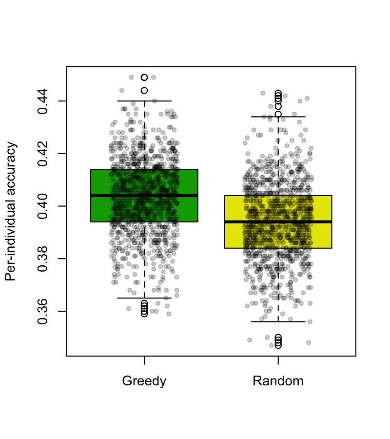
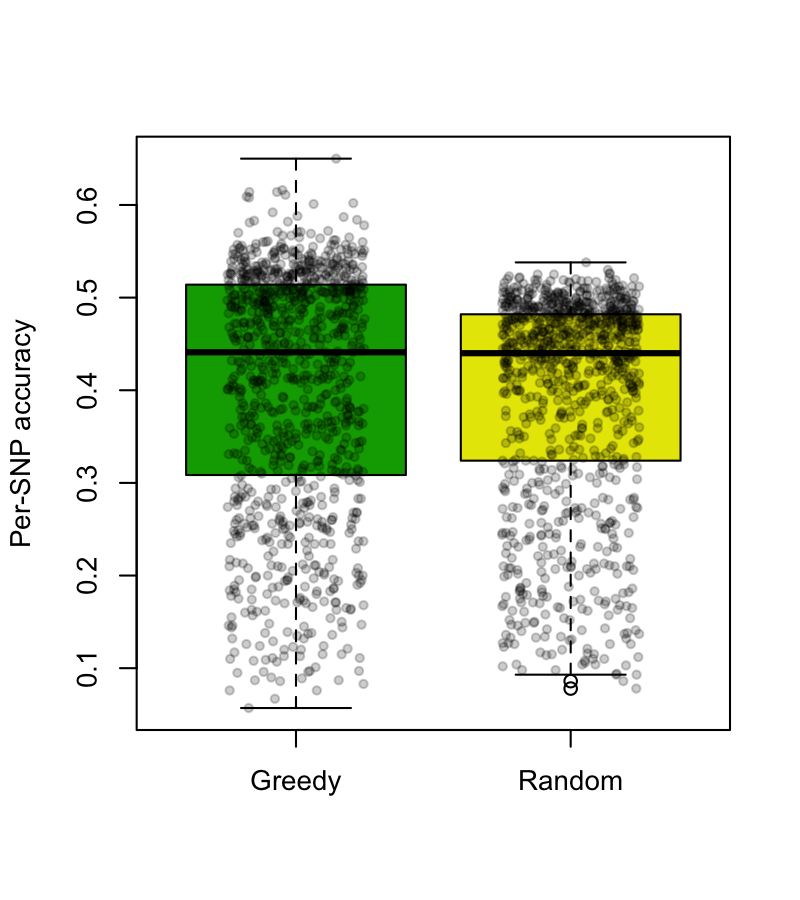
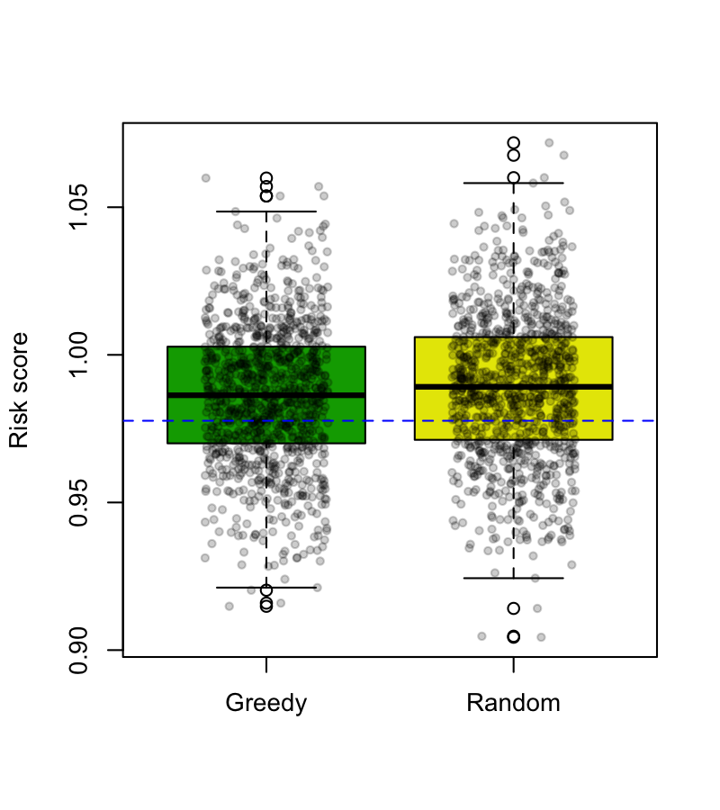

Greedy algorithm
================

This package includes codes that implement a greedy algorithm used in the simulations for **Genomic GPS** study. In this study, we define a distance vector, a vector of genetic distances of an individual measured to a set of publicly available individuals. We show that we can do many analyses using distance vectors while not disclosing individual genotypes. To show that it is very difficult to recover the genomic data from the summarized information in the distance vector, we designed this greedy algorithm. Given the distance vector, this algorithm stepwisely searches for the most likely set of genotypes that resemble whose distance vector resembles the observed distance vector. This package includes three modules:

Module 1: Data generation
------------------

This is an R script that generates the following:
1. Target sample genotypes (allele counts: 0/1/2)
2. Public reference data genotypes
3. Randomly chosen allele frequencies used for the generation
4. Distance vector between the target sample and the reference data

The default parameters are:
- Minimum MAF: 0.3
- Number of independent SNPs: 1000
- Number of reference individuals: 30
which can be changed by editing the script.

Run this module as follows:

```bash
Rscript 01_generate.R [output prefix]
```

Example outputs are included(```01_data1.*``` files).

Module 2: Greedy search
--------------------
This is a **Java code** that searches for the most likely candidate genotypes that gives the similar distance vector to the observed distance vector. It randomly chooses a SNP and change the allele count to the direction that the sum of squared error in distance vector decreases. If the error doesn't change in 1,000 steps, the algorithm quits. To avoid local optimum, the algorithm restarts from random starting point 1,000 times, and chooses the best one after all repeats.

To run it with the example dataset,

```bash
bash 02_compile_and_run.sh -nsnp 1000 -nref 30 -nsim 1000 -pref 01_data1
```
which will output 1,000 search results. Note that each search result is the best of 1,000 restarts. Thus, 1,000 search results represent 1,000,000 times of local searches.

The outputs are recorded to ```02_solutions.txt```. For comparison, random solutions based on the allele frequencies along are recorded to ```02_solutions.txt.rand```. Example outputs are included in the package.

Module 3: Comparison analysis
------------------------
This module compares the two sets of solutions, ```02_solutions.txt``` and ```02_solutions.txt.rand```, to the true solution ```01_data1.sam```, and performs some analysis.
1. It calculates the per-individual accuracy, performs t-test comparing the two groups, and generates plot.
2. It calculates the per-SNP accuracy, performs t-test comparing the two groups, and generates plot.
3. It calculates the risk score based on the randomly generated risk weights, performs t-test comparing the two groups, and generates plot.

The output example plots are:

</img>
</img>
</img>
